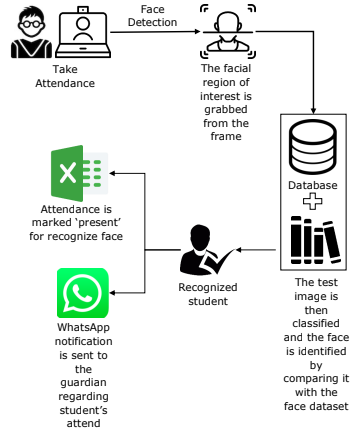

  

Class attendance is a system that helps institutions manage student attendance leads to taking students’ attendance using face recognition techniques. Successfully designed and executed a class attendance system as a solo project in 4 months for a Diploma final year project (fyp).

Objective :

1. To develop a student attendance system for class using face recognition techniques.
2. To send notification of student’s attendance to guardian through WhatsApp.
3. To automatically recognize student images within 5 seconds.
4. To generate student attendance reports for each student.

Limitation :

- The system only detects a face from a limited distance.
- The system cannot recognize multiple faces.
- The system cannot mark automatically when recognizing a student’s face.

Challenges Faced :

- Choosing suitable software and hardware to design a face recognition attendance system
- Types of database storage to keep student attendance data
- Identifying a suitable server for huge capacity storage.

  

  

In this project, we have three users responsible for the system. The staff and teacher who takes the attendance and admin who is responsible for managing students’ faces in the face’s database. Admin opens a camera to capture, collect and save images to database or a folder. After the collection and saving the process done, the training set manager start to extract faces from the image by face detection.

  

# Class Attendance using Face Recognition Sestem Demo Video

  <iframe width="700" height="700" src="https://www.youtube.com/embed/uP9MlDTOUzs" frameborder="0" allowfullscreen></iframe>

# Technologies Used

  

    
  

  

    
  

  

    
  

  

    
  

