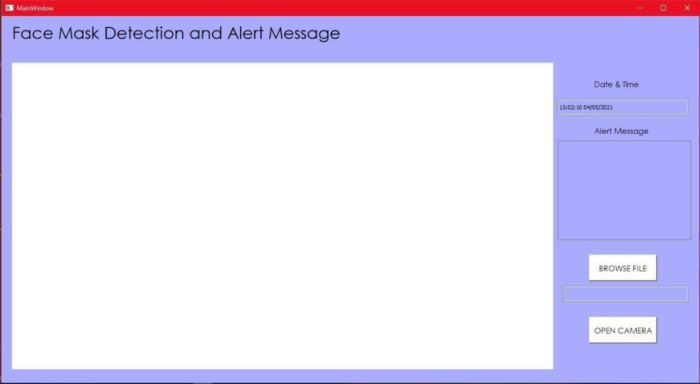

  

Face Mask Detection is a desktop application built with Python and using Tensorflow machine learning. This project was created in 1 month in an agile team of 4 for a digital image processing subject.

Objective

- To identify if a person is wearing a mask or not by recognizing and detecting the presence of a face mask on the face.
- To gives the percentage of people wearing a face mask and display an alert message if there is a presence or absence of a face mask.

  

  

  

# Face Mask Detection Sestem Demo Video

  <iframe width="700" height="400" src="https://www.youtube.com/embed/cEa_2xrp7Aw" frameborder="0" allowfullscreen></iframe>

# Technologies Used

  

    
  

  

    
  

  

    
  

  

    
  

