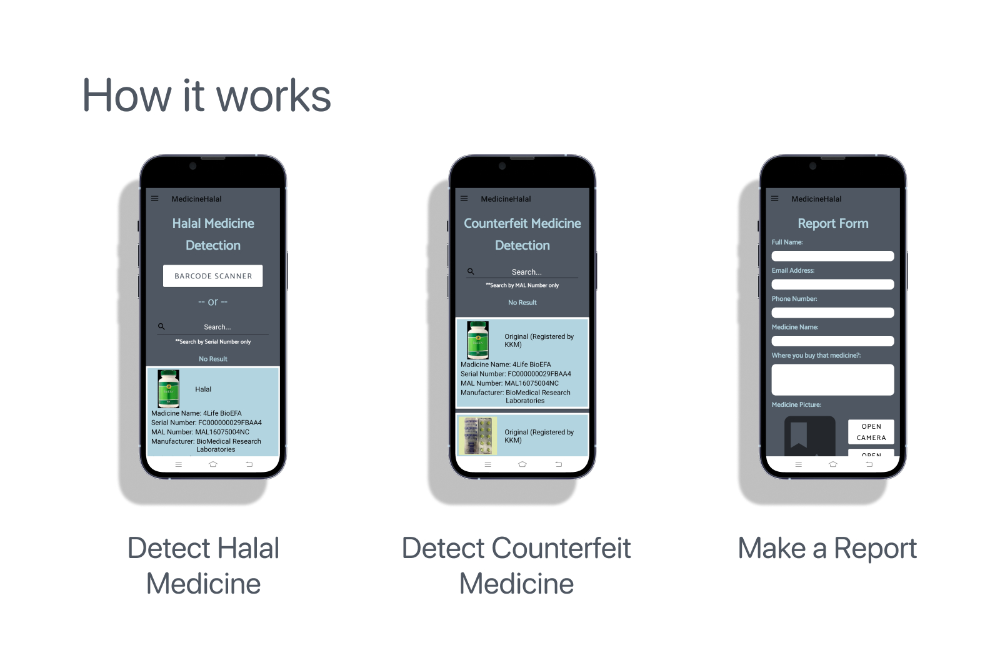

  

Medicine Halal or known as Advanced Medicine Halal Verification is a cross-platform Android application that allows users to easily detect halal medicine, access registration status, and report any issues, fostering a safer and more transparent healthcare environment. This app was created solo in 9 months for a Bachelor final year project (fyp).

  

  

  

# Medicine Halal App Demo Video

  <iframe width="700" height="700" src="https://www.youtube.com/embed/mvzK-22mIq4" frameborder="0" allowfullscreen></iframe>

# Technologies Used

  

    
  

  

    
  

  

    
  

  

    
  

