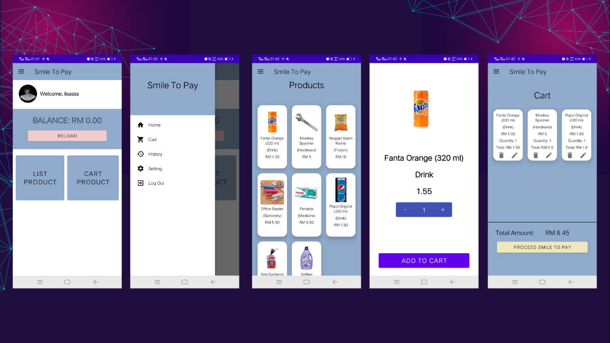
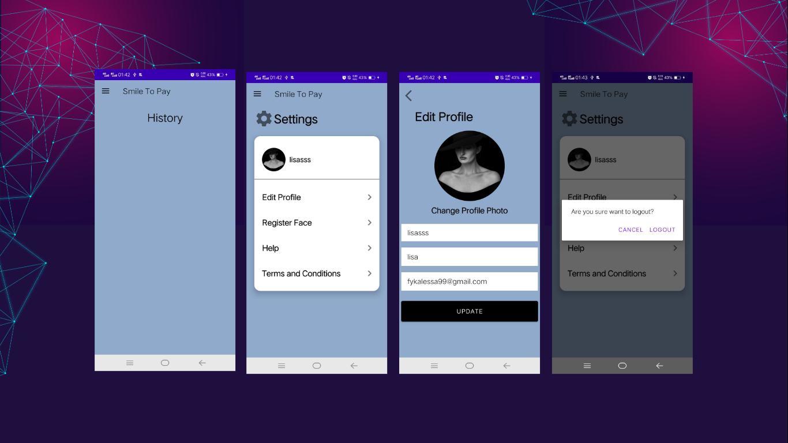

  

The app, called Smile to Pay, is an online shopping platform similar to Shopee and Lazada, featuring login, signup, product list, details, and cart pages. Our unique addition was a smile recognition feature before the payment and checkout. This app was developed in 5 months by an agile team of 3 for an internship project.

  

  

  

# Technologies Used

  

    
  

  

    
  

  

    
  

  

    
  

